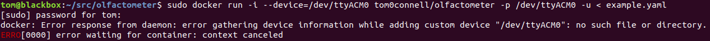

### Main commands

Run stimulus program defined in a YAML config file:
```
olf <config-file-path>
```
See [my config repo](https://github.com/tom-f-oconnell/tom_olfactometer_configs) 
for some examples.


Runs through all valves to test they are actuating:
```
olf-test-valves
```

Flushes all valves with long, appropriately balanced, pulses:
```
olf-flush
```

Runs a few pulses of the specified pin, balanced as appropriate:
```
olf-one-valve <pin>
```

Re-runs the last stimulus program attempted:
```
olf-retry
```

Prints the last stimulus program attempted, and copies its path to your clipboard:
```
olf-lastrun
```

### Supported microcontrollers

Anything with an AVR microprocessor that is compatible with the Arduino IDE
should work.

Known to work on:
- Arduino Mega 2560 (R3)

Some AVR based boards known not to work:
- Arduino Nano Every


### Installation

WARNING: these Docker instructions are out of date and may be removed. Better to follow
the development installation instruction below.

Just [install Docker](https://docs.docker.com/get-docker/), and proceed to the 
`Running` section below.

#### Windows 
The Docker method will unfortunately not work for typical Windows
configurations, and there does not seem to be a workaround. See 
[this issue](https://github.com/docker/for-win/issues/1018) for more details.

See the Windows specific installation instructions under the
`Development installation` section below.


### Running
Copy and paste this example configuration to a new file called `example.yaml`.
```
settings:
  # The parameters under this key are for specifying the timing of
  # individual trials (each with a single pulse from the valve(s)).
  # All trials will share this timing.
  # All of these parameters are in units of microseconds.
  timing:
    # Baseline period.
    pre_pulse_us: 1000000

    # How long the valve(s) will actually be delivering odor for.
    pulse_us: 1000000

    # Delay before next trial.
    # NOTE: the time from offset of the pulse to the onset of the
    # next trial (if there is one) will be:
    # (post_pulse_us + pre_pulse_us)
    post_pulse_us: 9000000

# Example trial structure with 4 trials. If your microcontroller 
# has pin 13 connected to the builtin LED (as Arduino Unos and 
# Megas do), running this config will flash that LED once per trial 
# (for 1s each time).
pin_sequence:
  # The rows in this bulleted list happen one after the other.
  # If the 'timing' key is specified above, each row
  # (i.e. "- pins: ...") will take
  # (pre_pulse_us + pulse_us + post_pulse_us) microseconds.
  pin_groups:
  # The pins listed in each of these rows will all be concurrently 
  # switched ONCE (LOW for pre_pulse_us -> HIGH for pulse_us ->
  # LOW for post_pulse_us)
  - pins: [13, 4, 5]
  - pins: [13, 4]
  - pins: [13]
  - pins: [13, 9, 7]
```

In everything below, replace `/dev/ttyACM0` with the port or serial device of
your Arduino. Run these commands from the same path that has the `example.yaml`
you created above inside of it.

To upload the code to your Arduino, and run an experiment after:
```
sudo docker run -i --device=/dev/ttyACM0 tom0connell/olfactometer -p /dev/ttyACM0 -u < example.yaml
```

To just run an experiment:
```
sudo docker run -i --device=/dev/ttyACM0 tom0oconnell/olfactometer -p /dev/ttyACM0 < example.yaml
```

If you get an error like this, it means that your Arduino is not actually
available at the port you specified (or it is just not connected). The easiest
way to check which port the Arduino is available under is using the Arduino
development environment, but there are other ways.




### Updating
```
sudo docker pull tom0connell/olfactometer
```


### Development installation
Do not follow these instructions unless the Docker method above is not possible
for you for some reason. You must verify that things are working as you intend.

#### Dependencies
- `python3.6+`
- `protoc>=3.0.0`
- `arduino-cli`
- A recent version of `pip` (`20.2.2` definitely works, `9.0.1` does not)

#### Installation
```
git clone https://github.com/tom-f-oconnell/olfactometer
cd olfactometer
```

If you are on Ubuntu 18.04, you should be able to install all the necessary
dependencies with this command. This will probably not work on other systems.
```
./scripts/install_18.04_deps.sh
```
If you are not using 18.04, and thus could not use the script above, also run
this command from within your local clone of this git repository:
```
git submodule update --init
```
If you did run the script for Ubuntu 18.04, it will have done the above git
command for you.

After you have installed the necessary dependencies:
```
# (make and activate a virtual environment here, if you would like)
pip install .
```

##### Windows
<details><summary>Windows specific installation instructions (click to expand)</summary>

1. Make sure that `python>=3.6` and `git` are installed. Git bash can be used for
   most / all of the commands below, or the Windows command prompt if you'd rather 
   / if Git bash has issues.

2. Follow the installation steps above, except `pip install .`

3. Download `arduino-cli` ZIP file [here](https://arduino.github.io/arduino-cli/latest/installation/),
   by following the `Windows 64 bit` link.

4. Extract and copy to `C:\Program Files\arduino-cli`, so that directly inside
   this new folder there is the `arduino-cli.exe` from the ZIP file.

5. Add `C:\Program Files\arduino-cli` to your `Path` environment variable, by
   pressing the Windows key, searching for "environment variable", clicking the
   result, and then clicking the `Environment Variables...` button at the
   bottom of the window that pops up. In the "User variables for
   <your-username>" section at the top, select the row for the `Path` variable,
   and select "Edit". In the new window, click the "New" button, to add a new
   path to this variable (which is a list of paths). Paste / type in
   `C:\Program Files\arduino-cli`.

   The above works for Windows 10. For Windows 7, you will need to select
   "Edit the system environment variables" from the search under the Windows key.
   Then the relevant variable will be "Path" under the "System variables" section.
   You will need to add (`;` separated) paths manually to this string. If you
   have a "Path" / "PATH" in the user specific section, you should use that
   rather than modify the system variable.

6. To finish setting up `arduino-cli`:

    ```
    arduino-cli core update-index
    arduino-cli core install arduino:avr
    ```

    You may need to answer a GUI prompt for administrator privileges for the
    second step above.

7. Download the latest `protoc-<x.y.z>-win64.zip` from [this 
   link](https://github.com/protocolbuffers/protobuf/releases). Repeat steps 4
   and 5 for this ZIP file, though copy the contents of the ZIP file to
   `C:\Program Files\protoc` and only add `C:\Program Files\protoc\bin` to
   `Path`.

8. `cd` to the `olfactometer` directory and (making sure that `python` is
   running the version of python you expect) run:
   `python -m pip install .`

9. Find where the `pip` command in step 8 created the `olf` executable, and add
   this to `Path` as well. For me, the path I needed to add was the path in the
   `Location` row of `python -m pip show olfactometer` output with `\Python38\Scripts`
   appended to the end:
   `C:\Users\tom\AppData\Local\Packages\PythonSoftwareFoundation.Python.3.8_qbz5n2kfra8p0\LocalCache\local-packages\Python38\Scripts`

   If `python -m pip show` doesn't work, you can also try:

    ```
    $ python
    >>> import olfactometer # don't call this from either <olfactometer> or the directory containing it
    >>> olfactometer.__file__
    ```
   
   ...and look around the directory that is output.

10. If you plan to run `olf` from Git bash, rather than the Windows command prompt,
    then you should edit `~/.bashrc` to add the line:

    ```
    export PYTHONUNBUFFERED=1
    ```
    
    ...so that interactive output when running stimulus programs is not delayed.

    Note that some of my attempts to install this on Windows have not been able
    to get `python` to work inside Git bash.

</details>


#### Running
The `-u` flag is only needed on the first run, or after changing the firmware.
```
olf -p <COM-port-of-your-Arduino> -u <config-file>
```

If you are not using the Docker version and you are unsure which port your
Arduino is on, you can run:
```
arduino-cli board list
```
...and note the value for the `Port` column in the row where `Board Name` is correct.
You can do the same via the Arduino GUI if you have it installed.


#### Testing valves
```
olf-test-valves
```

See `olf-test-valves -h` for command line options.


#### Updating

```
cd <where-you-cloned-olfactometer>
git pull
# (activate relevant virtual environment, if you used one)
pip uninstall olfactometer -y
pip install .
```


### Environment variables (optional)

You may set `OLFACTOMETER_HARDWARE_DIR` to a directory that contains YAML
config files (`.yaml` suffix), and then use `OLFACTOMETER_DEFAULT_HARDWARE` to
control which hardware definition within that directory is used by default.
These options are only relevant for either config files that have a
`generator: <generator-name>` line or when using `olf-test-valves`. For more
information on how generators can be used, see 
[my repo](https://github.com/tom-f-oconnell/tom_olfactometer_configs) of config
files for use with this repo, as well as the `./olfactometer/generators`
directory within this repo.

If you are using Windows, see the Windows installation instructions above for
steps to set environment variables.


### Building Docker image
```
./docker_build.sh
```


#### Todo

Add instructions for how to interface with this.
- one example using subprocess around the docker installed version
  (and test that it can work OK from non-root python processes...)
- and using "from olfactometer import main" (assuming dev install)

